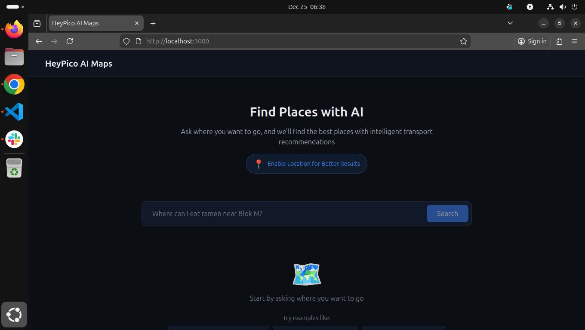
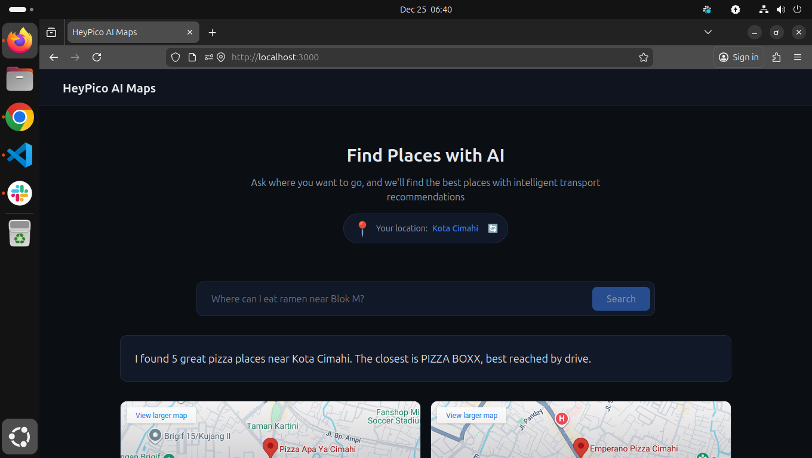
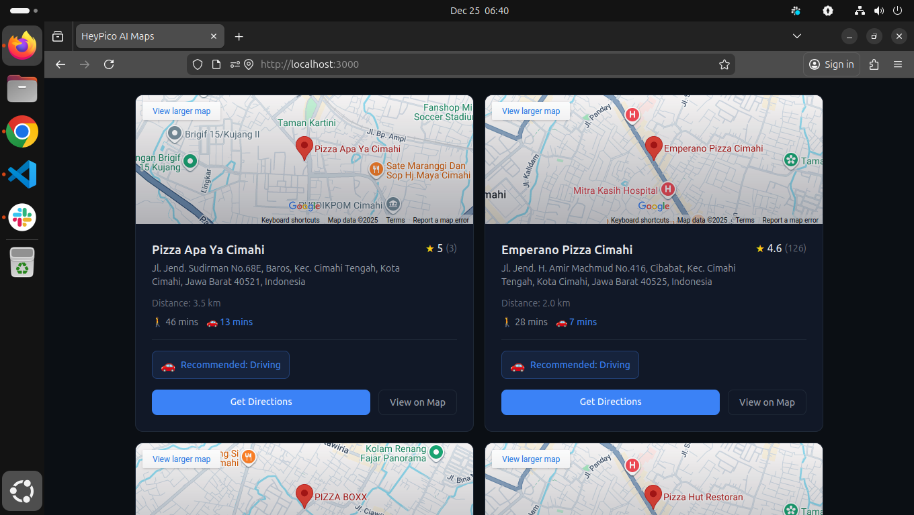

# HeyPico AI Maps LLM

> AI-powered location search with intelligent transport recommendations

A production-quality demo application showcasing AI-to-tool automation, clean backend integration, and thoughtful UX for technical evaluation at HeyPico.ai.

## 📸 Screenshots

### Main Interface


### Search Results with Embedded Maps


### Place Cards with Transport Recommendations


## 🎯 Overview

This application allows users to ask natural language questions like **"Where can I eat ramen near Blok M?"** and receive:

- AI-powered intent extraction
- Curated place recommendations
- Distance and duration calculations
- Intelligent transport recommendations (walk/bike/drive)
- Interactive map with directions

## ✨ What's Included

This repository includes:

* **Full-stack Application**: FastAPI backend + Next.js frontend with TypeScript
* **AI Integration**: Ollama/Llama 3.2 for natural language understanding with fallback parsing
* **Google Maps Integration**: Places API, Distance Matrix API, Geocoding API, and Maps Embed API
* **Smart Location Handling**: Automatic GPS-based location detection and "near me" query processing
* **Transport Intelligence**: Walk/bike/drive recommendations based on distance and time
* **Embedded Maps**: Individual maps on each place card for visual context
* **Rate Limiting**: Built-in middleware to protect API endpoints
* **Security Best Practices**: Environment variables, CORS configuration, API key restrictions
* **Comprehensive Documentation**: 
  - `README.md` - Complete setup and usage guide
  - `ASSUMPTIONS.md` - Design decisions and technical rationale
  - `TASKS.md` - Development checklist and progress tracking
  - `DELIVERY.md` - Deployment and delivery instructions
* **Production-Ready Code**: Clean architecture, error handling, logging, and type safety
* **Testing Tools**: Backend test script (`test_backend.py`) for API validation

## 🏗️ Architecture

```
┌─────────────────────────────────────────────────────────────────┐
│                         User Query                               │
│              "Where can I eat ramen near Blok M?"                │
└───────────────────────────┬─────────────────────────────────────┘
                            │
                            ▼
┌─────────────────────────────────────────────────────────────────┐
│                    Next.js Frontend (React)                      │
│  • Captures user input                                           │
│  • Gets geolocation (browser API)                                │
│  • Displays results with map                                     │
└───────────────────────────┬─────────────────────────────────────┘
                            │ HTTP POST /api/query
                            ▼
┌─────────────────────────────────────────────────────────────────┐
│                    FastAPI Backend (Python)                      │
│  ┌──────────────────────────────────────────────────────────┐   │
│  │  1. LLM Service (Ollama/Llama 3.2)                       │   │
│  │     Extracts: {"query": "ramen", "location": "Blok M"}   │   │
│  └──────────────────────────────────────────────────────────┘   │
│                            │                                     │
│  ┌──────────────────────────────────────────────────────────┐   │
│  │  2. Google Maps Places API                               │   │
│  │     Returns: 5 ramen places near Blok M                  │   │
│  └──────────────────────────────────────────────────────────┘   │
│                            │                                     │
│  ┌──────────────────────────────────────────────────────────┐   │
│  │  3. Google Distance Matrix API                           │   │
│  │     Calculates: walk/bike/drive times from user location │   │
│  └──────────────────────────────────────────────────────────┘   │
│                            │                                     │
│  ┌──────────────────────────────────────────────────────────┐   │
│  │  4. Transport Recommendation Logic                       │   │
│  │     • Walk ≤ 7 min → recommend walk                      │   │
│  │     • Bike ≤ 10 min → recommend bike                     │   │
│  │     • Else → recommend drive                             │   │
│  └──────────────────────────────────────────────────────────┘   │
└───────────────────────────┬─────────────────────────────────────┘
                            │
                            ▼
┌─────────────────────────────────────────────────────────────────┐
│                       Structured Response                        │
│  • AI-generated text summary                                     │
│  • List of places with distances                                 │
│  • Transport recommendations                                     │
│  • Google Maps links                                             │
└─────────────────────────────────────────────────────────────────┘
```

## 🚀 Quick Start

### Prerequisites

1. **Python 3.11+** with pip
2. **Node.js 18+** with npm
3. **Ollama** installed and running ([Installation Guide](https://ollama.ai))
4. **Google Maps API Key** with Places API and Distance Matrix API enabled

### Step 1: Install Ollama & Pull Model

```bash
# Install Ollama (macOS/Linux)
curl -fsSL https://ollama.ai/install.sh | sh

# Pull Llama 3.2 model
ollama pull llama3.2

# Verify Ollama is running
ollama list
```

### Step 2: Backend Setup

```bash
cd backend

# Create virtual environment
python -m venv venv
source venv/bin/activate  # On Windows: venv\Scripts\activate

# Install dependencies
pip install -r requirements.txt

# Create .env file
cp .env.example .env

# Edit .env and add your Google Maps API key
# GOOGLE_MAPS_API_KEY=your_actual_api_key_here
```

**Start the backend:**
```bash
uvicorn app.main:app --reload --port 8000
```

Backend will be available at: http://localhost:8000  
API docs: http://localhost:8000/docs

### Step 3: Frontend Setup

```bash
cd frontend

# Install dependencies
npm install

# Create .env.local file
cp .env.example .env.local

# Edit .env.local and add your Google Maps Embed API key (can be same as backend key)
# NEXT_PUBLIC_GOOGLE_MAPS_EMBED_API_KEY=your_actual_api_key_here
```

**Start the frontend:**
```bash
npm run dev
```

Frontend will be available at: http://localhost:3000

## 📁 Project Structure

```
heypico-ai-maps-llm/
├── backend/
│   ├── app/
│   │   ├── main.py              # FastAPI entry point
│   │   ├── routers/
│   │   │   └── query.py         # Query endpoint
│   │   ├── services/
│   │   │   ├── llm_service.py   # Ollama LLM integration
│   │   │   └── google_maps_service.py  # Google Maps APIs
│   │   ├── schemas/
│   │   │   └── models.py        # Pydantic models
│   │   └── utils/
│   │       └── env_config.py    # Environment configuration
│   ├── requirements.txt
│   ├── .env.example
│   └── README.md
│
├── frontend/
│   ├── app/
│   │   ├── page.tsx             # Main page with query logic
│   │   ├── layout.tsx           # App layout
│   │   └── globals.css          # Global styles
│   ├── components/
│   │   ├── ChatInput.tsx        # Search input
│   │   ├── PlaceCard.tsx        # Place display card
│   │   ├── MapView.tsx          # Google Maps embed
│   │   └── LoadingSkeleton.tsx  # Loading state
│   ├── package.json
│   ├── .env.example
│   └── README.md
│
├── TASKS.md                     # Development checklist
├── ASSUMPTIONS.md               # Design decisions & assumptions
├── README.md                    # This file
└── .gitignore
```

## 🔐 Security Considerations

### API Key Management
- **Backend API keys** stored in environment variables only
- Never exposed to client-side code
- `.env` files excluded from version control via `.gitignore`

### CORS Configuration
- Explicitly configured allowed origins
- Default: `http://localhost:3000`
- Configurable via `ALLOWED_ORIGINS` environment variable

### Input Validation
- All inputs validated with Pydantic schemas
- No SQL injection risk (no database)
- Query length limits enforced

### Privacy
- User location never stored or logged
- No user tracking or analytics
- No persistent data storage

## 🧠 LLM Configuration

### Recommended: Llama 3.2
- **Strengths**: Excellent structured output, fast, lightweight
- **Format**: JSON-only responses
- **Fallback**: Regex-based extraction if LLM fails

### Alternative Models
```bash
# Mistral (faster, slightly less accurate)
ollama pull mistral

# Phi-3 (very lightweight)
ollama pull phi3

# Llama 3.1 (more powerful, slower)
ollama pull llama3.1
```

Update `LLM_MODEL` in backend `.env` to use different models.

## 🗺️ Google Maps Setup

### Required APIs
1. **Places API** - For location search
2. **Distance Matrix API** - For travel time calculations
3. **Maps Embed API** - For map display (frontend)

### API Key Restrictions (Recommended)
- Restrict by HTTP referrer (frontend key)
- Restrict by IP address (backend key)
- Set usage quotas to prevent overuse

### Free Tier Limits
- Places API: ~17,000 requests/month
- Distance Matrix API: ~40,000 elements/month
- Embed API: Unlimited (with restrictions)

## 🎨 UI Design

### Dark Theme Palette
- **Background**: `#0B0F14` (Primary), `#111827` (Surface)
- **Text**: `#E5E7EB` (Primary), `#9CA3AF` (Secondary)
- **Accent**: `#3B82F6` (Blue)

### Design Principles
- Clean, minimal, and technical
- Information-first approach
- Calm and focused experience
- Inspired by: OpenAI Dashboard, Vercel, Linear

### Responsive Layout
- Mobile-first design
- Touch-friendly buttons
- Readable text sizes
- Collapsible sections

## 🔄 Data Flow

1. **User Input**: Natural language query entered
2. **Geolocation**: Browser requests user location (optional)
3. **Backend Call**: Frontend sends query + coordinates to `/api/query`
4. **LLM Extraction**: Backend extracts structured intent
5. **Places Search**: Google Places API finds matching locations
6. **Distance Calculation**: Distance Matrix API computes travel times
7. **Transport Logic**: Backend recommends walk/bike/drive
8. **Response**: Structured JSON returned to frontend
9. **Display**: Frontend renders results with map

## 📊 Transport Recommendation Logic

```python
def recommend_transport(walk_minutes, bike_minutes, drive_minutes):
    if walk_minutes <= 7:
        return "walk"
    elif bike_minutes <= 10:
        return "bike"
    else:
        return "drive"
```

**Rationale:**
- **Walking ≤ 7 min**: Comfortable in tropical climate, zero cost
- **Biking ≤ 10 min**: Fast, eco-friendly, practical for medium distances
- **Driving > 10 min**: Best for longer distances, includes ride-hailing

## 🐛 Error Handling

### LLM Failures
- Automatic fallback to regex-based extraction
- Default location: Jakarta
- Always returns valid structure

### API Failures
- Graceful degradation (places without distances)
- User-friendly error messages
- No application crashes

### Network Issues
- Timeout handling (30s for LLM)
- Retry logic for transient failures
- Clear error feedback to user

## 📝 Development Notes

### Backend (FastAPI)
- Fully async for performance
- Clean separation of concerns
- Type-safe with Pydantic
- Comprehensive error handling

### Frontend (Next.js)
- App Router with RSC where appropriate
- Client components for interactivity
- TypeScript for type safety
- Tailwind CSS for styling

## 🧪 Testing

### Manual Testing Queries
```
"Where can I eat ramen near Blok M?"
"Find coffee shops in Menteng"
"Best pizza places in Sudirman"
"Sushi restaurants near me"
```

### Expected Response Time
- **With geolocation**: 3-6 seconds
- **Without geolocation**: 2-5 seconds

## 📚 Additional Documentation

- [TASKS.md](TASKS.md) - Development checklist and progress
- [ASSUMPTIONS.md](ASSUMPTIONS.md) - Design decisions and rationale
- [backend/README.md](backend/README.md) - Backend-specific documentation
- [frontend/README.md](frontend/README.md) - Frontend-specific documentation

## 🎯 Project Goals Achieved

✅ **AI-to-Tool Automation**: LLM extracts intent → APIs provide data  
✅ **Clean Backend Integration**: FastAPI with clear service separation  
✅ **Secure API Handling**: Environment-based key management  
✅ **Thoughtful UX**: Dark theme, loading states, error handling  
✅ **Clear Documentation**: Comprehensive README, assumptions, and code comments

## 🚧 Known Limitations

- Limited to 5 places per query (API quota management)
- No authentication or user accounts
- No saved searches or history
- English-only interface
- Requires active internet connection

## 🔮 Future Enhancements

- Multi-language support
- Public transit integration
- Real-time traffic updates
- User preferences and saved searches
- Mobile app (React Native)
- Voice input support

## 📄 License

This project is created for technical evaluation purposes at HeyPico.ai.

## 👤 Author

Built with care for HeyPico.ai technical assessment.

---

**Questions?** Check [ASSUMPTIONS.md](ASSUMPTIONS.md) for detailed design decisions.

test